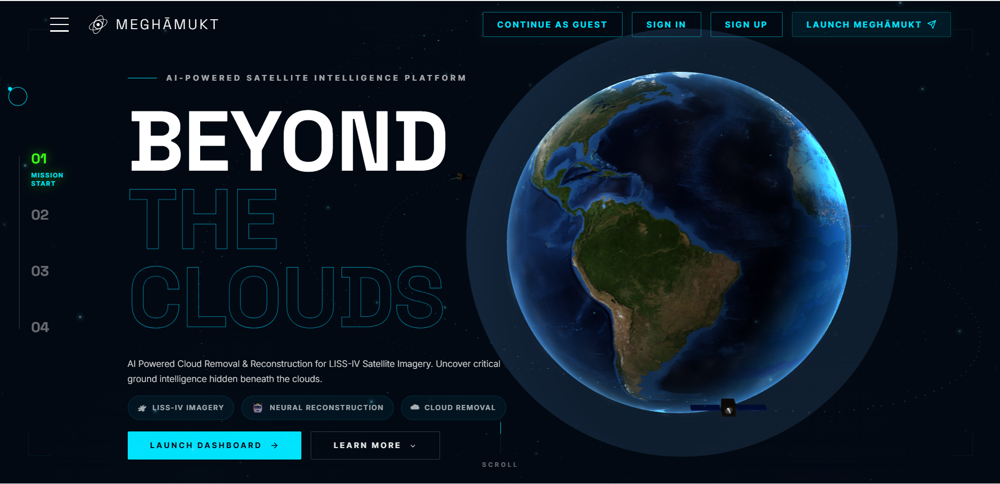
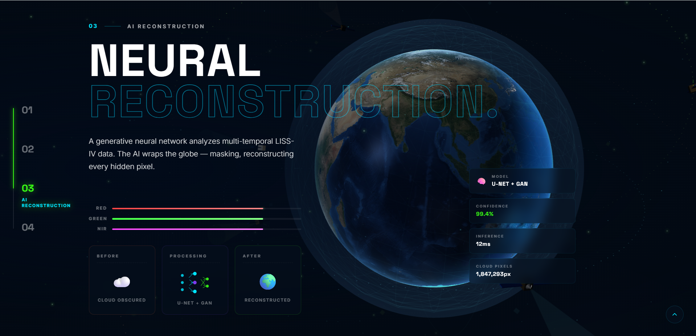
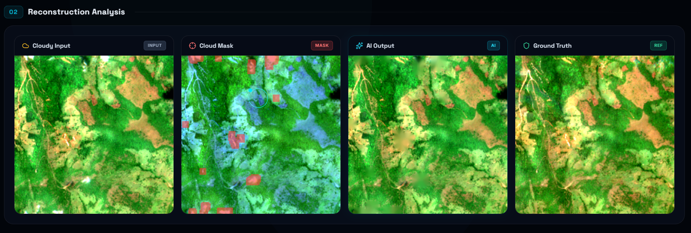
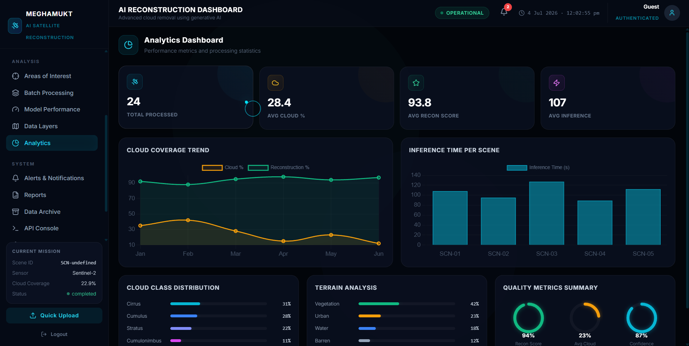
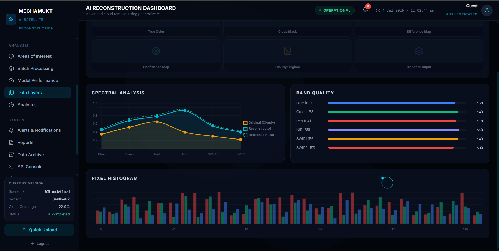
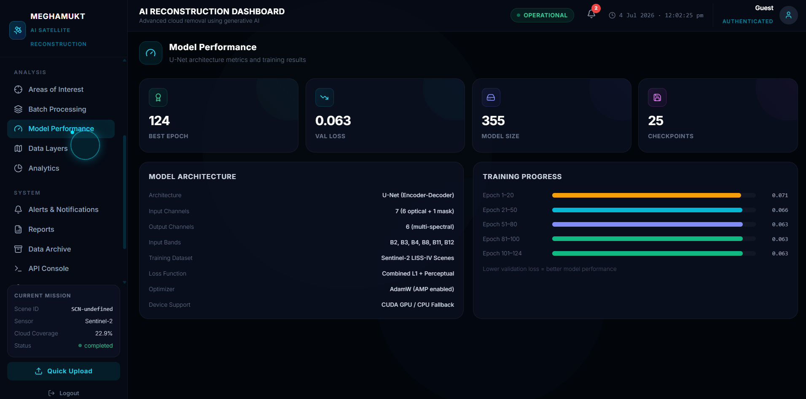

# MeghaMukt: AI-Powered Satellite Cloud Reconstruction Platform

**PS-2 — Generative AI-Based Cloud Removal and Reconstruction for LISS-IV Satellite Imagery**

*   **Live Demo:** [https://meghamukt.vercel.app/](https://meghamukt.vercel.app/)
*   **Presentation PDF:** [Bah Hackathon.pdf](docs/Bah_Hackathon.pdf)

MeghaMukt is an advanced AI-powered web platform developed for intelligent cloud detection and cloud-free satellite image reconstruction. Built for the Bharatiya Antariksh Hackathon, the system combines deep learning, modern web technologies, and an interactive mission-control dashboard to transform cloud-obstructed satellite imagery into analysis-ready scenes.

The platform provides an end-to-end workflow—from uploading Sentinel-2 imagery to cloud detection, AI reconstruction, visualization, model evaluation, and performance monitoring—all through a futuristic, space-inspired user interface.

## Objective

MeghaMukt aims to reconstruct cloud-obscured satellite imagery while preserving spatial structures and spectral characteristics, enabling researchers, disaster management teams, agricultural analysts, and environmental scientists to obtain high-quality cloud-free imagery for accurate geospatial analysis.

## Landing Experience

The homepage is designed as an immersive space mission experience featuring an interactive 3D Earth visualization. Users are guided through the complete satellite reconstruction pipeline with cinematic animations explaining:
* The challenge of cloud-covered satellite imagery
* AI-based cloud detection
* Neural reconstruction using deep learning
* Generation of cloud-free analysis-ready images
* Real-time mission completion statistics

The landing page introduces the project with a modern space-themed interface that reflects real satellite mission control systems.

## AI Reconstruction Dashboard

The dashboard serves as the operational center of the application.
Users can:
* Upload Sentinel-2 satellite imagery
* Automatically detect cloud-covered regions
* Generate cloud masks
* Perform AI-based cloud reconstruction
* Compare reconstructed imagery against ground truth
* View inference results in real time

The dashboard presents four synchronized visualization panels:
1. Cloudy Satellite Image
2. Cloud Mask
3. AI Reconstructed Image
4. Ground Truth Reference

This side-by-side comparison allows users to visually inspect reconstruction quality.

## Analytics Dashboard

The Analytics section provides a comprehensive overview of reconstruction performance through interactive visualizations. It includes:
* Total processed scenes
* Average cloud coverage
* Reconstruction quality score
* Average inference time
* Cloud coverage trends
* Terrain analysis
* Cloud class distribution
* Quality metric summaries
* Processing statistics

The interface enables quick monitoring of overall system performance.

## Data Layers & Spectral Analysis

The platform exposes multiple diagnostic data layers for satellite image analysis.
Available layers include:
* True Color Image
* Cloud Mask
* Difference Map
* Confidence Map
* Cloudy Original
* Blended Reconstruction

Additional scientific visualizations include:
* Spectral response curves
* Multi-band quality analysis
* Pixel histograms
* Band-wise accuracy indicators
* Sentinel-2 band information

These tools help evaluate reconstruction quality beyond simple visual inspection.

## AI Model Performance Monitoring

The application includes a dedicated page for monitoring deep learning model performance. Displayed information includes:
* Model architecture
* Best training epoch
* Validation loss
* Model size
* Saved checkpoints
* Training progress
* Optimizer configuration
* Input/output channels
* Dataset information
* Device configuration

This enables continuous monitoring of the training process and model evolution.

## AI Reconstruction Pipeline

The system follows a complete AI processing workflow:
1. Satellite Image Upload
2. Data Preprocessing
3. Cloud Detection
4. Binary Cloud Mask Generation
5. AI-Based Cloud Reconstruction
6. Post-Processing & Image Fusion
7. Quality Assessment
8. Final Cloud-Free Output Generation

Each processing stage is visualized within the dashboard, providing transparency throughout the reconstruction process.

## Features
* AI-powered cloud removal
* Swin U-Net based image reconstruction
* Automatic cloud mask generation
* Interactive satellite image comparison
* Real-time inference monitoring
* Spectral band visualization
* Reconstruction quality analysis
* Performance analytics dashboard
* Responsive dark-themed mission control interface
* Modern animated user experience
* Comprehensive model evaluation and reporting

## Technologies Used

**Artificial Intelligence**
* Swin U-Net
* PyTorch
* LPIPS
* SSIM
* PSNR
* SAM
* AdamW Optimizer
* Mixed Precision Training (AMP)

**Satellite Data**
* Sentinel-2 L2A Imagery / LISS-IV Imagery
* Multi-spectral Bands
* Cloud Masks
* GeoTIFF Processing

**Frontend**
* HTML5
* CSS3
* JavaScript
* GSAP Animations
* Three.js
* Interactive Dashboard Components

**Backend**
* Python
* Flask/FastAPI (Node.js/Express implemented)
* Image Processing Pipeline
* REST APIs

## Installation
1.  Clone this repository.
2.  Install Python dependencies for the AI model: pip install -r cloud-reconstruction/requirements.txt
3.  Install Node dependencies for the backend and dashboard: cd backend && npm install
4.  Ensure cloud-reconstruction/dataset and cloud-reconstruction/checkpoints_swin are populated with your data and weights.

## Usage
1.  Start the AI Backend: cd backend && npm start
2.  Open your browser and navigate to http://localhost:8000/dashboard
3.  Upload your satellite images to trigger the pipeline.
4.  To run headless training or evaluation, use python cloud-reconstruction/train_optimized.py.

## Folder Structure
*   `backend/`: Node.js Express server to handle uploads and interface with the AI Python scripts.
*   `cloud-reconstruction/`: The core AI Python pipeline (preprocessing, models, training, evaluation).
*   `frontend/`: Frontend web components for the interactive dashboard (HTML, CSS, JS, assets).
*   `docs/`: Additional documentation and forensic verification data.
*   `scripts/`: Utility shell scripts.
*   `sample_data/`: 2-5 small example patches (optional).
*   `requirements.txt`: Python pip dependencies.
*   `environment.yml`: Conda environment definition.

## 👥 Team

| Member | Role | GitHub |
|---------|------|--------|
| **B.N.V. Chaitanya Yadav** | Team Leader, Project Planning & System Integration | [@bogulachaitanya](https://github.com/bogulachaitanya) |
| **B.N.L. Niharika** | Data Preprocessing, Cloud Mask Generation & Validation | [@bogulaniharika](https://github.com/bogulaniharika) |
| **G. Akshaya** | Research, Documentation & Presentation | [@akshayagajjela](https://github.com/akshayagajjela) |
| **T. Akshay Kountesh** | AI Model Development, Swin U-Net, Backend, Dashboard & Deployment | [@24A31A4660](https://github.com/24A31A4660) |

## 🤝 Contributors

This project was developed collaboratively by Team **MeghaMukt** for the **Bharatiya Antariksh Hackathon 2026 (Problem Statement PS-2)**.

Special contributions include:

- **B.N.V. Chaitanya Yadav**
  - Team Leadership
  - Project Planning
  - System Architecture
  - Team Coordination

- **B.N.L. Niharika**
  - Dataset Preparation
  - Data Preprocessing
  - Cloud Detection & Validation
  - Testing

- **G. Akshaya**
  - Research
  - Literature Survey
  - Documentation
  - Presentation Design

- **T. Akshay Kountesh**
  - AI Model Development
  - Swin U-Net Implementation
  - Model Training & Evaluation
  - Backend Development
  - Dashboard Development
  - GitHub Repository Management
  - Deployment & Integration

- B.N.V. Chaitanya Yadav
  

- B.N.L. Niharika
  

- G. Akshaya
  

- T. Akshay Kountesh
  

## Future Improvements
*   Implement end-to-end Dockerization for a fully portable microservices architecture.
*   Integrate temporal fusion using more advanced recurrent attention mechanisms across historical acquisitions.
*   Explore continuous on-device learning for edge-deployment in ground stations.

## License
MIT License. See LICENSE for details.

